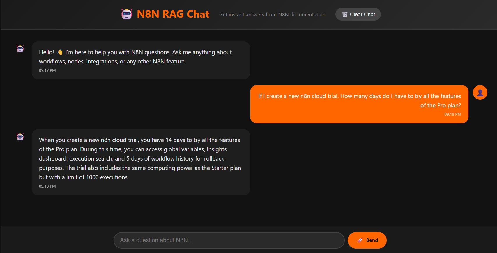

# N8N RAG Chat

A beautiful chat interface for querying N8N documentation using Retrieval-Augmented Generation (RAG). Ask questions about N8N workflows, nodes, integrations, and get instant explanations powered by local AI.



## 🌟 Features

- **Dark Mode Interface** with orange accents
- **Real-time Chat** with conversation history
- **Markdown Support** for rich AI responses
- **Responsive Design** for mobile and desktop
- **Error Handling** and loading states
- **Local AI Integration** with LM Studio

## 🔧 How It Works

1. **Vector Search**: Queries are encoded using Sentence Transformers and searched against the N8N documentation using ChromaDB
2. **Context Retrieval**: Top relevant chunks are retrieved and fed to the AI model
3. **Answer Generation**: Local LLM (via LM Studio) generates clear explanations based on the context

### Explanation of VectorDB-Data/build_vectors.py

The `build_vectors.py` script is designed to process a large text document (`n8n_docs.txt`) and convert it into a vector database using ChromaDB, enabling efficient similarity searches for Retrieval-Augmented Generation (RAG) applications. It handles large files by streaming chunking to avoid memory issues.

#### Key Components and Process:

1. **Configuration**:

   - `DOCS_TXT = "n8n_docs.txt"`: The input text file containing N8N documentation.
   - `PERSIST_DIR = "chroma_db"`: Directory where the persistent ChromaDB is stored.
   - `COLLECTION_NAME = "n8n_docs"`: Name of the Chroma collection.
   - `CHUNK_SIZE = 500`: Text chunks are ~500 characters for manageable embedding size.
   - `CHUNK_OVERLAP = 100`: Overlapping chunks (100 characters) preserve context across boundaries.
   - `EMBED_MODEL = "all-MiniLM-L6-v2"`: Pre-trained SentenceTransformer model for generating embeddings.
   - `BATCH_SIZE = 64`: Batches of 64 chunks are processed together for efficiency.

2. **Chunking Function (`chunk_file`)**:

   - Reads the file line-by-line to minimize memory usage.
   - Accumulates text in a buffer until it reaches `CHUNK_SIZE`.
   - Yields chunks of ~500 characters, with `CHUNK_OVERLAP` (100 characters) from the previous chunk to maintain continuity.
   - This streaming approach prevents loading the entire file into memory at once, suitable for large docs like n8n documentation.

3. **Main Execution (`main`)**:

   - **Validation**: Checks if `n8n_docs.txt` exists; exits if not.

   - **Embedding Model Loading**: Initializes SentenceTransformer with `all-MiniLM-L6-v2`, a lightweight model producing 384-dimensional embeddings.

   - **ChromaDB Setup**:

     - Creates a persistent Chroma client that saves to `chroma_db/`.
     - Deletes any existing `n8n_docs` collection to ensure a fresh rebuild.
     - Creates a new collection with the specified name.

   - **Batch Processing**:

     - Iterates through chunks from `chunk_file` using `tqdm` for progress tracking.
     - Accumulates chunks, IDs (`n8n_{i}`), and metadata into batches of `BATCH_SIZE`.
     - Engages embeddings for each batch using the loaded model (embeddings converted to NumPy then lists for Chroma compatibility).
     - Adds the batch to the Chroma collection, storing documents, IDs, metadata, and embeddings.
     - Processes remaining chunks after the loop.

   - **Output**: Saves the vector database permanently in `chroma_db/` for reuse (e.g., in RAG for querying similar N8N docs based on user questions).

#### How ChromaDB Was Created:

- The script ingested `n8n_docs.txt` (public N8N documentation) by chunking it into overlapping text segments.
- Each chunk was embedded into a vector using SentenceTransformer, capturing semantic meaning for similarity searches.
- Vectors were stored in a Chroma collection (`n8n_docs`), persisting to disk as SQLite-based files (visible in `chroma_db/`: `chroma.sqlite3`, binary indexes, etc.).
- This enables fast retrieval of relevant documentation chunks for RAG, where user queries are similarly embedded and matched against stored vectors.

The resulting ChromaDB supports efficient vector similarity queries, powering N8N documentation retrieval in the RAG chat system.

## 📋 Requirements

- **Python 3.8+**
- **LM Studio** with a chat model loaded (e.g., qwen2.5-7b-instruct, gemma-3-4b)
- **Dependencies**: Listed in the installation section

## 🚀 Quick Start

### 1. Setup Virtual Environment & Dependencies

```bash
# Create virtual environment
python -m venv venv

# Activate virtual environment
# Windows:
venv\Scripts\activate
# Linux/Mac:
source venv/bin/activate

# Install Python packages
pip install -r requirements.txt

# Setup Chroma Vector Database
python build_vectors.py
```

### 2. Start LM Studio
- Launch LM Studio
- Load your preferred chat model (e.g., qwen2.5-7b-instruct)
- Start the local server (default: localhost:1234)

### 3. Run the Application
Open two terminal/command windows and keep both running:

**Terminal 1 (Backend API):**
```
python server.py
```

**Terminal 2 (Frontend):**
```
cd frontend
python -m http.server 3000
```

### 4. Open Browser
- Navigate to: `http://localhost:3000`
- Start chatting! Both terminals must remain open for the app to function.

## 📁 Project Structure

```
├── server.py              # FastAPI backend with RAG logic
├── run_app.py             # Multiserver launcher (Python)
├── start_app.bat          # One-click Windows launcher
├── build_vectors.py       # Vector database builder
├── n8n_docs.txt           # Processed documentation
├── chroma_db/             # Vector database storage
└── frontend/
    ├── index.html         # Chat interface
    ├── styles.css         # Dark theme styling
    └── script.js          # Frontend logic
```

## 💬 Usage

1. **Ask Questions** about N8N in natural language
   - "How do I create a workflow?"
   - "Explain HTTP Request node"
   - "What are credentials for?"

2. **AI Responses** include:
   - Clear explanations (no link spam)
   - Markdown formatting (code blocks, lists)
   - Practical guidance

3. **Chat Features**:
   - Conversation history
   - Clear chat option
   - Loading indicators

## 🔄 Switching AI Models

1. Update model in `server.py`:
   ```python
   LM_MODEL = "qwen2.5-7b-instruct"  # Change to your model
   ```

2. Restart the backend server: `python server.py`

3. The model must be loaded in LM Studio first

## 🎨 Customization

### Themes
Edit `frontend/styles.css` to customize colors:
- Primary: `--dark-bg: #0f0f0f`
- Accent: `#ff6600` (orange)
- Text: `#e5e5e5`

### Model Configuration
In `server.py`:
```python
TOP_K = 5              # Number of context chunks
EMBED_MODEL = "all-MiniLM-L6-v2"  # Sentence transformer model
```

## 🛠️ Development

### Adding New Docs
1. Update `n8n_docs.txt` with new content
2. Re-run: `python build_vectors.py`
3. Restart the backend server

### API Endpoints
- `GET /` - Health check
- `POST /chat` - Send question, get answer

```json
// POST /chat
{
  "question": "How do I use the Schedule Trigger?"
}

// Response
{
  "answer": "The Schedule Trigger allows you to run workflows..."
}
```

## 🐛 Troubleshooting

**Connection Errors**
- Ensure both servers are running
- Check ports: API on 5000, frontend on 3000
- Verify LM Studio is running on 1234

**Empty Responses**
- Run `python build_vectors.py` to build DB
- Check if `chroma_db/` folder exists

**Model Issues**
- Verify model name matches LM Studio exactly
- Check LM Studio terminal for model load errors

## 💡 Contributing

1. Fork and clone
2. Create feature branch
3. Test changes thoroughly
4. Submit pull request

## 📄 License

MIT License - see LICENSE file for details.

## 🙏 Acknowledgments

- [N8N](https://n8n.io/) for the amazing workflow platform
- [ChromaDB](https://www.trychroma.com/) for vector storage
- [Sentence Transformers](https://sbert.net/) for embeddings
- [LM Studio](https://lmstudio.ai/) for local AI hosting
